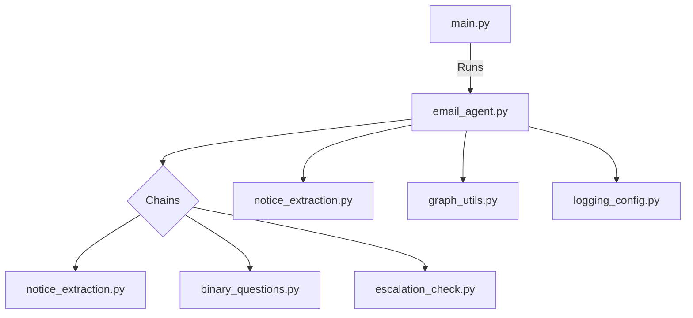

# 📧 EMAIL AGENT USING LANGGRAPH

Welcome to the **Email Agent using LangGraph**! This project leverages the power of [LangGraph](https://github.com/langchain-ai/langgraph) to automate, analyze, and process emails using advanced language models and custom logic chains.

---

## 🚀 Features

- **Automated Email Analysis**: Extracts notices, checks for escalation, and answers binary questions from emails.
- **Graph-Based Workflow**: Utilizes LangGraph to create modular, maintainable, and extensible processing pipelines.
- **Custom Chains**: Easily add or modify logic for new email processing tasks.
- **Logging & Utilities**: Built-in logging and utility functions for robust operation.

---

## 🗂️ Project Structure

```text
EMAIL AGENT USING LANGGRAPH/
│
├── main.py                  # Entry point for running the agent
├── example_emails.py        # Example emails for testing
│
├── chains/                  # Modular logic chains
│   ├── binary_questions.py
│   ├── escalation_check.py
│   └── notice_extraction.py
│
├── graphs/                  # LangGraph graph definitions
│   ├── email_agent.py
│   └── notice_extraction.py
│
└── utils/                   # Utilities and logging
    ├── graph_utils.py
    ├── logging_config.py
    └── __pycache__/
```

---

## 🛠️ Installation

1. **Clone the repository:**
   ```powershell
   git clone <repo-url>
   cd "EMAIL AGENT USING LANGGRAPH"
   ```
2. **Install dependencies:**
   ```powershell
   pip install -r requirements.txt
   ```
   *(Create a `requirements.txt` if not present, with packages like `langgraph`, `langchain`, etc.)*

---

## ⚡ Usage

1. **Configure your environment:**
   - Set up any required API keys or environment variables for language models.
2. **Run the main agent:**
   ```powershell
   python main.py
   ```
3. **Test with example emails:**
   - Modify `example_emails.py` to add your own samples.

---

## 🧩 How It Works

- **Chains**: Each file in `chains/` implements a specific logic unit (e.g., extracting notices, checking for escalation).
- **Graphs**: The `graphs/` folder defines how these chains are connected and orchestrated using LangGraph.
- **Utils**: Shared utilities for logging and graph management.

---

## 🌐 Interactive Demo

> **Try it out!**
>
> 1. Add your email samples to `example_emails.py`.
> 2. Run the agent and observe the output in your terminal.
> 3. Modify or extend chains/graphs to suit your workflow.

---

## 📈 Visual Overview



---

## 🧑‍💻 Contributing

1. Fork the repo
2. Create a new branch (`git checkout -b feature/your-feature`)
3. Commit your changes
4. Open a Pull Request

---

## 📄 License

This project is licensed under the MIT License.

---

## 🙋‍♂️ Questions?

Open an issue or contact the maintainer for support!

---

<p align="center">
  
  
</p>

---

> **Made with ❤️ using LangGraph and Python**
